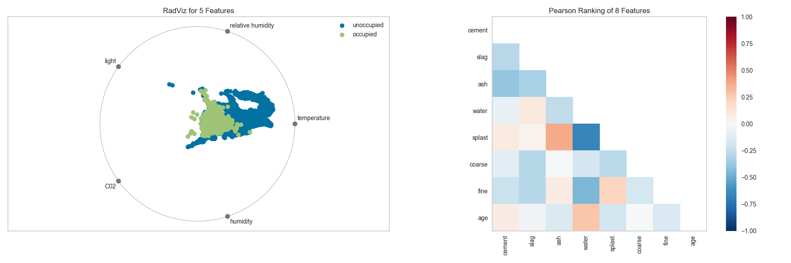
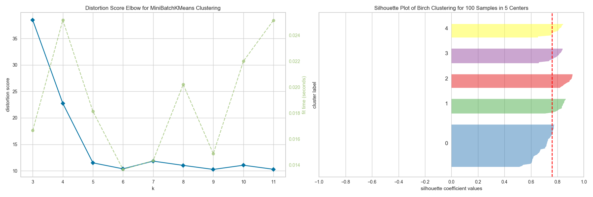
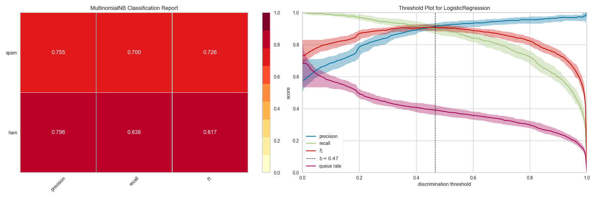

# Summary

Discussions of machine learning are frequently characterized by a singular focus on algorithmic behavior. Be it logistic regression, random forests, Bayesian methods, or artificial neural networks, machine learning practitioners are often quick to express their preference. However, model selection is more nuanced than simply picking the “right” or “wrong” algorithm. In practice, the workflow includes multiple iterations through feature engineering, algorithm selection, and hyperparameter tuning, summarized by Kumar et al. as a search for the maximally performing model selection triple [@kumar2016model]. “Model selection,” they explain, “is iterative and exploratory because the space of [model selection triples] is usually infinite, and it is generally impossible for analysts to know a priori which [combination] will yield satisfactory accuracy and/or insights.”

Treating model selection as search has led to automation through grid search methods, standardized APIs, drag and drop GUIs, and specialized database systems. However, the search problem is computationally intractable and research in both machine learning [@wickham_visualizing_2015] and visual analytics [@liu_wang_liu_zhu_2017] suggests human intuition and guidance can more effectively hone in on quality models than exhaustive optimization methods. By visualizing the model selection process, data scientists can interactively steer towards final, interpretable models and avoid pitfalls and traps [@kapoor2010interactive].

<!-- transition to next paragraph could be smoother -->

Yellowbrick is a Python visualization package for machine learning that allows a wide audience of users to steer and understand the model selection process. For data scientists, Yellowbrick helps evaluate the stability and predictive value of machine learning models and improves the speed of the experimental workflow. For data engineers, Yellowbrick provides visual tools that allow monitoring of the performance of models in real world applications and assist in diagnosing problems and errors. For users of models, Yellowbrick provides visual interpretation of the behavior of the model in high dimensional feature space. Finally, for students, Yellowbrick is a framework for understanding a large variety of algorithms and methods.

Yellowbrick achieves visual steering by extending both scikit-learn [@sklearn] and Matplotlib [@matplotlib]. Like Yellowbrick, both scikit-learn and Matplotlib are extensions of SciPy [@scipy], libraries intended to facilitate scientific computing. Scikit-learn provides a generalized API for machine learning by exposing the concept of an `Estimator`, an object that learns from data. Yellowbrick in turn extends this concept with the idea of a `Visualizer`, objects that learn from data and visualize them. Visualizers wrap Matplotlib procedures to produce publication-ready figures and rich visual analytics.

Because Yellowbrick is part of a rich visual and machine learning ecosystem, it provides visualizations for feature and target analysis, classification, regression, and clustering model visualization, hyperparameter tuning, and text analysis. A few selected examples of visual diagnostics for model selection and their interpretations follow.

<!-- note: removed the API section because of the JOSS submission guidance: "Given this paper format, a “full length” paper is not permitted, e.g., software documentation such as API (Application Programming Interface) functionality should not be in the paper and instead should be outlined in the software documentation." We can save this section for the CHI or SIGMOD paper -->

Because “more data beats better algorithms” [@rajaraman2008more], the first step to creating valid and predictive models is to find precisely the minimum set of features that predicts the dependent variable. Generally, this means finding features that describe data in high-dimensional space that are *separable*, that is a hyperplane can be drawn between related data. Tools like `RadViz`, `ParallelCoordinates`, and `Manifold` help visualize high dimensional for quick diagnostics. Other models, such as Bayesian models and regressions suffer when independent variables are collinear, that is they exhibit a pairwise correlation. `Rank2D` visualizations show pairwise correlations among features and can facilitate feature elimination.

Searching for structure in unlabelled data can be challenging, especially because evaluation of both partitive and agglomerative techniques is largely qualitative. When using K-Means models, choosing K has a large impact on the quality of the analysis; using the `KElbowVisualizer` may help select the best K given computational constraints such as how long computing centroids takes. The `SilhouetteVisualizer` shows the relationship of points in each cluster relative to other clusters and gives an overview of the composition of each cluster.

Regression models hypothesize that there is some underlying function influenced by noise whose central tendency can be inferred. The `PredictionError` shows the relationship of the actual values to the predicted values, giving a sense of heteroskedasticity in the target data, or regions of more or less error as model predictions deviate from the 45 degree line. The `ResidualsPlot` shows the relationship of error in the training and test data set and can also show regions of increased variability in the model.

Classification model analysis focuses on the precision and recall of the model against individual classes. The `ClassificationReport` provides a visual heatmap of these metrics, allowing quick and easy comparison between models and spotting trouble metrics. The `DiscriminationThreshold` for binary classifiers shows how adjusting the threshold for positive classification may influence the precision and recall globally, as well as the number of points that may require manual checking for stricter determination.

Yellowbrick includes many more visualizations, intended to fit directly into the machine learning workflow, and many more are being added in each new release. From text analysis-specific visualizations to missing data analysis, to a `contrib` module that focus on other machine learning libraries, Yellowbrick has tools to facilitate all parts of hypothesis driven development. The source code for Yellowbrick has been archived to Zenodo and the most recent version can be obtained with the linked DOI: [@zenodo].

# Acknowledgements

Since we first introduced the idea of Yellowbrick at PyCon 2016, many people have joined us in research labs and have stuck with us through 12 releases, ensuring the success of the project. Nathan Danielsen joined very early on and was one of our first maintainers, bringing an engineering perspective to our work and giving us much needed stability in testing. Larry Gray, Neal Humphrey, Jason Keung, Prema Roman, Kristen McIntyre, Jessica D'Amico and Adam Morris have also all joined our project as maintainers and core contributors, and we can't thank them enough.

Yellowbrick would not be possible without the invaluable contributions of those in the Python and Data Science community. At the time of this writing, GitHub reports that 44 contributors have submitted pull requests that have been merged and released and we expect this number to continue to grow. Every week, users submit feature requests, bug reports, suggestions and questions that allow us to make the software better and more robust. Other users write blog posts about their experience with Yellowbrick, encouraging both those new to machine learning and those that are old hat to more fully understand the models they are fitting. We can't thank the community enough for their support and their ongoing participation.

# References
